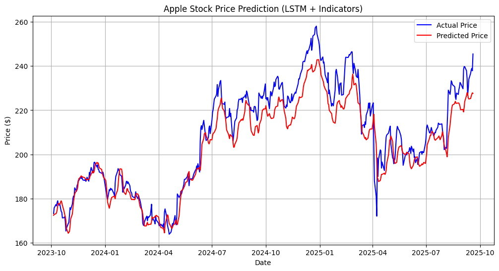

# 📈 Stock Price Prediction using LSTM


> LSTM-based deep learning model to predict Apple (AAPL) stock prices using 10 years of historical data — achieving an R² score of 0.88.

---

## 🧠 Problem Statement

Stock price prediction is one of the most challenging time-series forecasting problems due to market volatility and non-linear patterns. This project uses an LSTM neural network — designed specifically for sequential data — to learn from 10 years of Apple stock history and forecast future closing prices.

---

## 🔁 Pipeline Flow

```
Yahoo Finance (yfinance) → 10 Years AAPL Data
        ↓
Preprocessing (MinMaxScaler, 60-day lookback window)
        ↓
LSTM Model (LSTM + Dropout + Dense layers)
        ↓
Predictions vs Actual Prices
        ↓
Evaluation (MAE, MSE, RMSE, R²)
```

---

## 📊 Results

| Metric | Value |
|---|---|
| **MAE** | 6.32 |
| **MSE** | 64.89 |
| **RMSE** | 8.06 |
| **R² Score** | **0.88** |

The model explains **88% of the variance** in Apple's stock price movement — demonstrating strong predictive performance on unseen test data.

### Prediction vs Actual



---

## 🗂️ Dataset

- **Source:** Yahoo Finance via `yfinance` library
- **Stock:** Apple Inc. (AAPL)
- **Period:** 2015 – 2025 (10 years)
- **Features:** Open, High, Low, Close, Volume, Adj Close
- **Target:** Closing Price

The dataset is included in this repo as `stock_data.csv`. It can also be fetched live using `yfinance`.

---

## 📁 Project Structure

```
stock-price-prediction/
│
├── stock.ipynb          # Full pipeline — data fetch, preprocessing, model, evaluation
├── stock_data.csv       # Historical AAPL data (2015–2025)
├── output.png           # Predicted vs Actual price chart
├── requirements.txt     # Python dependencies
├── .gitignore
└── README.md
```

---

## 🛠️ Tech Stack

| Tool | Purpose |
|---|---|
| Python 3.11 | Core language |
| yfinance | Fetching historical stock data from Yahoo Finance |
| TensorFlow / Keras | LSTM model building and training |
| Pandas + NumPy | Data preprocessing and manipulation |
| Scikit-learn | MinMaxScaler, evaluation metrics |
| Matplotlib | Visualization of predictions vs actuals |

---

## 🧱 Model Architecture

| Layer | Details |
|---|---|
| Input | 60-day lookback window |
| LSTM | Sequential pattern learning |
| Dropout | Regularization to prevent overfitting |
| Dense | Output layer for price prediction |
| Optimizer | Adam |
| Loss | Mean Squared Error (MSE) |

---

## 🚀 Getting Started

### 1. Clone the Repository
```bash
git clone https://github.com/sunilraj180805/stock-price-prediction.git
cd stock-price-prediction
```

### 2. Install Dependencies
```bash
pip install -r requirements.txt
```

### 3. Run the Notebook
```bash
jupyter notebook stock.ipynb
```

Run all cells — data is fetched automatically via `yfinance`, or loaded from `stock_data.csv`.

---

## ⚠️ Limitations

- Stock prices are inherently unpredictable — this model identifies patterns but cannot guarantee future accuracy
- Trained only on Apple (AAPL) — retraining needed for other stocks
- Does not account for external events (news, earnings, macro events) that cause sudden price movements
- Past performance does not imply future results

---

## 🔮 Future Scope

- Add sentiment analysis from financial news as additional input features
- Multi-stock prediction with transfer learning
- Real-time prediction dashboard using Streamlit
- Hyperparameter tuning with Optuna

---

## 📜 License

This project is licensed under the [MIT License](LICENSE).

---

## 🙋 Author

**Sunilraj D**
[GitHub](https://github.com/sunilraj180805)
